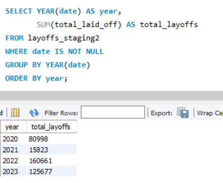
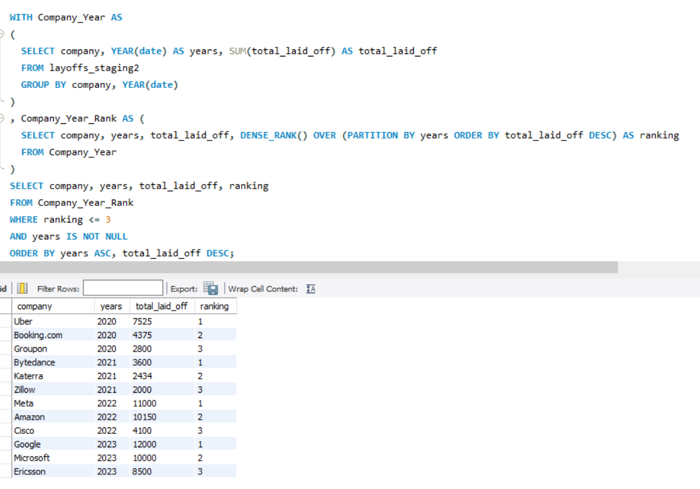

# MySQL Layoffs Exploratory Data Analysis (EDA)

## Overview
This project performs **Exploratory Data Analysis (EDA)** on a cleaned layoffs dataset using **MySQL**.  
The dataset used here comes from a prior data-cleaning project, where raw layoffs data was standardized and prepared for analysis.

The objective of this project is to uncover **trends, patterns, and key insights** from the data using SQL queries.

---

## Dataset
- **Source:** Cleaned layoffs dataset
- **Table used:** `layoffs_staging2`
- The dataset includes information about:
  - Company
  - Location
  - Industry
  - Total layoffs
  - Percentage laid off
  - Date
  - Funding raised

> Note: All analysis is performed on already cleaned and standardized data to ensure accuracy.

---

## Tools Used
- **MySQL**
- **MySQL Workbench**

---

## Key EDA Questions Explored
- How did layoffs change over time?
- Which companies had the highest layoffs each year?
- What patterns emerge when comparing companies across different years?

---

## Key Insights

### Layoffs Over Time
This analysis shows the total number of layoffs aggregated by year, highlighting major trends and spikes.

**Observation:**
- Layoffs increased significantly in 2022, followed by a decline in 2023.
- This reflects broader market and economic shifts affecting tech and related industries.

---

### Top Companies by Layoffs (Per Year)
Using CTEs and window functions, the top 3 companies with the highest layoffs were identified for each year.

**Observation:**
- Different companies dominate layoffs in different years.
- Large tech companies appear prominently during peak layoff periods.
- Ranking analysis provides a clearer year-by-year comparison than overall totals.

---

## SQL Techniques Used
- Aggregate functions (`SUM`, `YEAR`)
- Common Table Expressions (CTEs)
- Window functions (`DENSE_RANK`)
- Grouping and ordering for analytical insights

---

## Key Learnings
- EDA is about asking **meaningful questions**, not just writing queries
- Time-based analysis reveals trends that raw aggregates cannot
- Window functions are powerful for ranking and comparative analysis
- Clean data is essential for reliable insights

---

## Related Project
This EDA project builds on a prior MySQL **Data Cleaning Project**, where the raw layoffs data was prepared for analysis.

---

## 👤 Author
**Shruti Singh** 
- GitHub: https://github.com/Shrutiji007  
- LinkedIn: https://www.linkedin.com/in/shruti-singh-7a599030b

